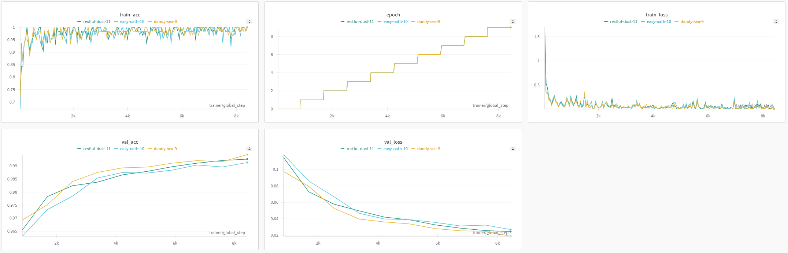

## Description
This is a basic ML project. We train a simple CNN model on the MNIST dataset. Here are the objectives:

1) Save and load data as HDF5 file.
2) Create custom torch Dataset and Dataloader.
3) Utilize Pytorch Lightning.
    - Create custom callbacks for logging and checkpointing
    - Visualize metrics in real-time using experiment manager
4) Create an API class that wraps the full pipeline.
    - Create default parser of arguments

Here are some of the resources used:

https://github.com/fgnt/mnist

https://colab.research.google.com/github/wandb/examples/blob/master/colabs/pytorch-lightning/Optimize_Pytorch_Lightning_models_with_Weights_%26_Biases.ipynb#scrollTo=xSRvBS39lEig

https://lightning.ai/docs/pytorch/stable/api/lightning.pytorch.callbacks.EarlyStopping.html#lightning.pytorch.callbacks.EarlyStopping

https://lightning.ai/docs/pytorch/stable/extensions/callbacks.html

# Wandb Graphs:

